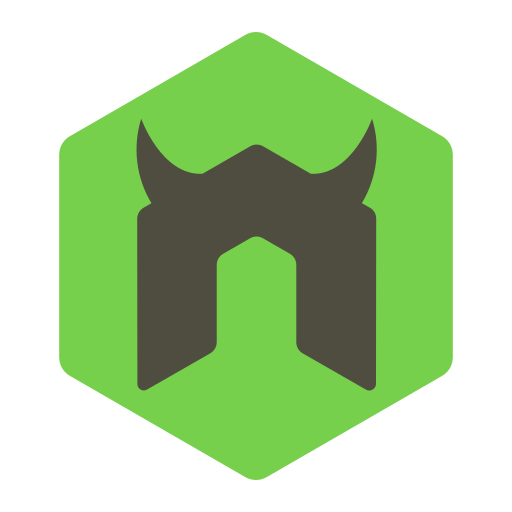
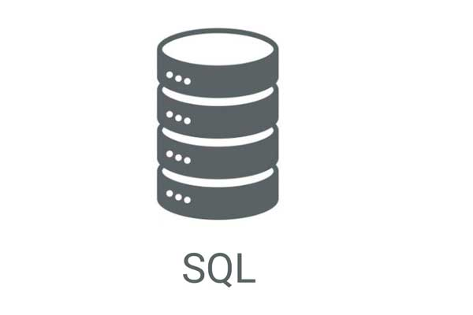

  
 
 # PROJECT BAKCEND-SQL 

 An appointment management system for a dental clinic.

## START 
    1. Clone our repo.
    
        - HTTPS: git clone https://github.com/Alvaro-78/backend-sql.git
    
        - SSH KEY: git clone git@github.com:Alvaro-78/backend-sql.git

    2. Download node_modules folder.

        - npm install

    3. Run Docker and PHP my ADMIN

        - docker-compose up
        - Go to https://localhost:8080
    
    4. Run localhost with Nodemon.

        - npm start
    
    5. Create a DataBase with sequelize.

        - sequelize db:create

    6. Run pending migrations.

        - sequelize db:migrate

    7. Run every seeder.

        - sequelize db:seed:all

    8. Go to Postman.

## POSTMAN

    1. You can Run in Postman our project.

    2. You can see our Postman Documentation on the next link.
[Postman Documentation](https://documenter.getpostman.com/view/14551927/Tz5jg1Wj)

## ABOUT THE PROJECT

    Hi! We are Alvaro and Robert,

    and we have generated a fictitious business model about a small dental clinic.

    We have created a database where we can store the data of a customer, 
    
    a dentist and an appointment. Also, you can create, update, 
    
    get, and delete this data if you want.

    Finally, you can make a dental appointment, generate a user login and a logout.

    
    NOTE: If you want to play with our database, 
    
    you will need to know the following sequelize commands:

    sequelize db:migrate                        Run pending migrations
    sequelize db:migrate:schema:timestamps:add  Update migration table to have timestamps
    sequelize db:migrate:status                 List the status of all migrations
    sequelize db:migrate:undo                   Reverts a migration
    sequelize db:migrate:undo:all               Revert all migrations ran
    sequelize db:seed                           Run specified seeder
    sequelize db:seed:undo                      Deletes data from the database
    sequelize db:seed:all                       Run every seeder
    sequelize db:seed:undo:all                  Deletes data from the database
    sequelize db:create                         Create database specified by configuration
    sequelize db:drop                           Drop database specified by configuration
    sequelize init                              Initializes project
    sequelize init:config                       Initializes configuration
    sequelize init:migrations                   Initializes migrations
    sequelize init:models                       Initializes models
    sequelize init:seeders                      Initializes seeders
    sequelize migration:generate                Generates a new migration
                                                                       

## TEAM PROJECT

    
    We have worked using the methodology pair-programing

    on two different branches called master and dev.

    You can follow our journey in Trello 
    
    and you can see our commits in the following links:

[Trello](https://trello.com/b/neMBMHy8/project-sql)

[Commits](https://github.com/Alvaro-78/backend-sql/tree/master)

## TECHNOLOGIES

    We have used the following technologies:

        - MySQL2
        - Express
        - Sequelize
        - Nodemon
        - Postman
        - Docker
        - Javascript
        - Git
        - Trello

## AUTORS

Alvaro: 

[Repository](https://github.com/Alvaro-78)

email: alvaro78an@gmail.com

Robert:

[Repository](https://github.com/Roo-Git)

email: robert.martinez.delafuente@gmail.com 